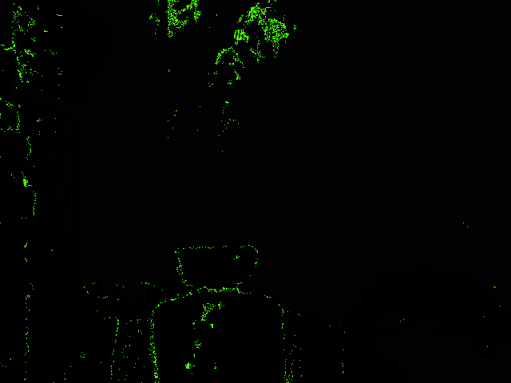

# i named this poorly

Do you have a Kinect? Xtion? Whatever? Do you like dancing, and/or rainbows? Maybe you should use this Processing app at your next event where

* you expect there shall be dancing, or at least moving, or at least people taking up space and reflecting infrared light, as physical matter typically does
* you are composed of matter that reflects infrared light (almost forgot that, SUPER important tho)
* a kinect or xtion is present

But also where

* rainbows are NOT present
* you or someone you love would like there to be more than zero rainbows present
* you are okay with merely VIRTUAL rainbows instead of real ones, or ideally you recognize that rainbows are effects of observation rather than physical objects, and therefore eschew artificial distinctions between equally virtual constructs; and indeed such a perspective, while practical to have in order to use this application, would surely prove wise for one to carry through life.
* :rainbow:

# more???

no more. go away
